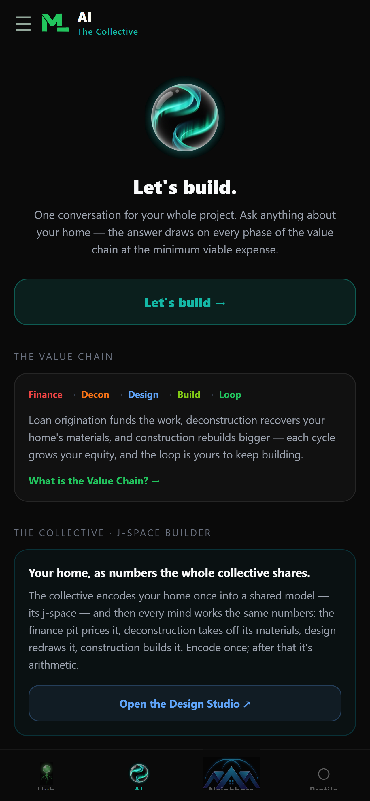
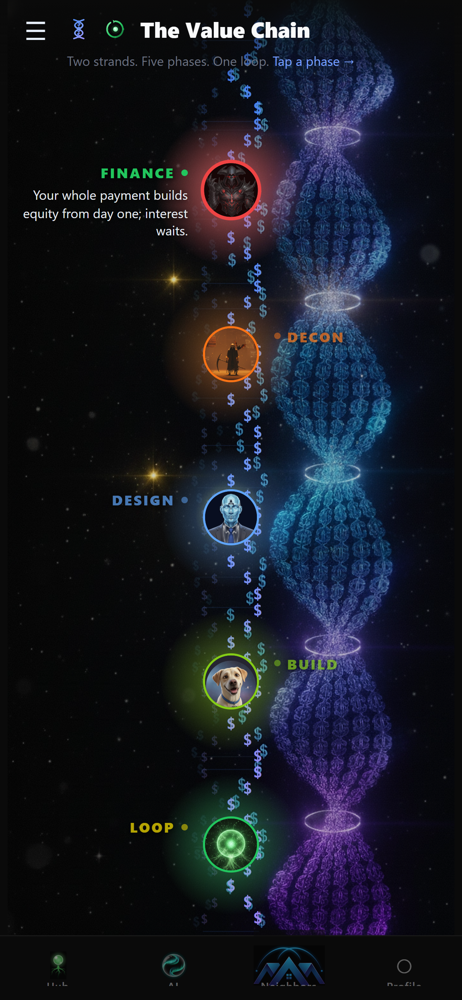
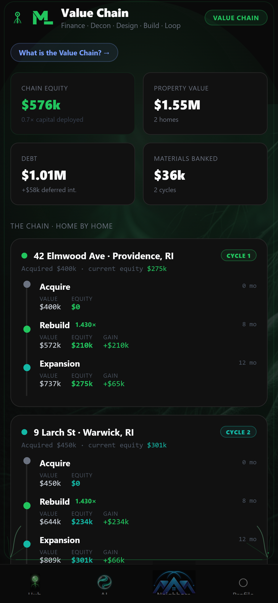
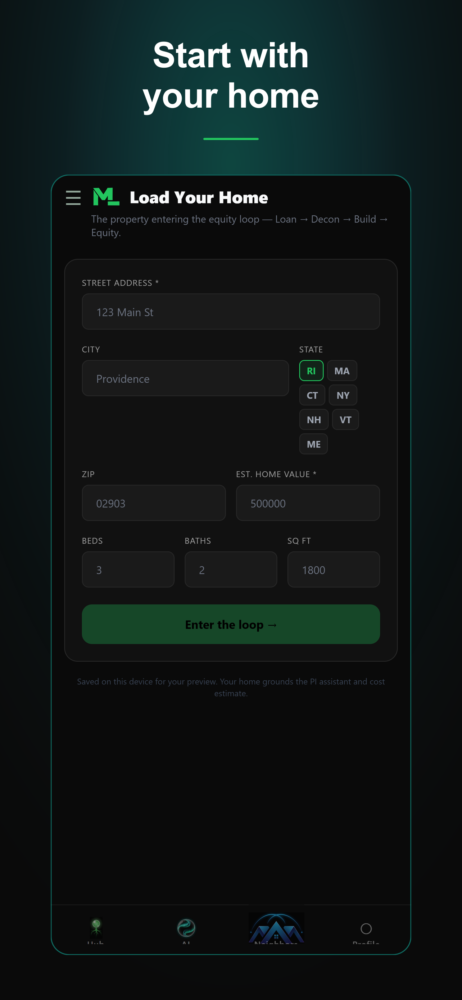
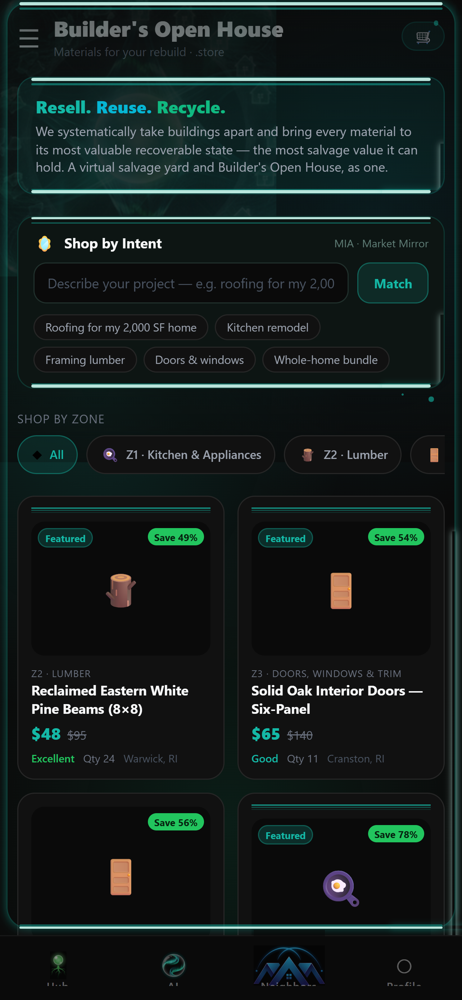
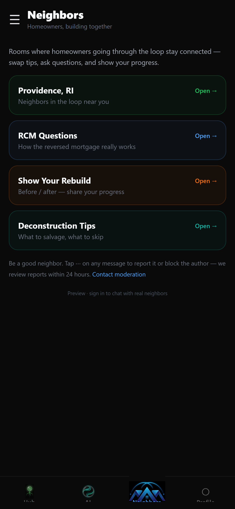
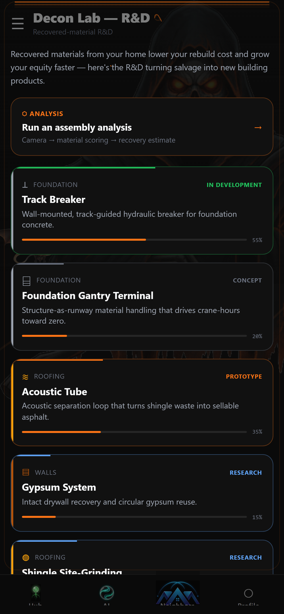
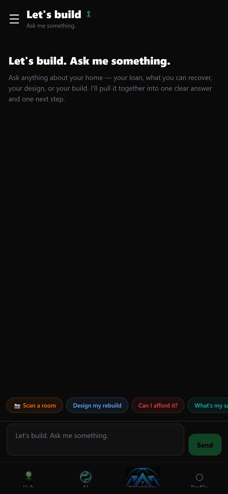

# ML Systems — the Deconstruction-to-Construction Equity Loop

> **Tougher Problems Inspire Creative Solutions.**
>
> ML Systems is a Rhode Island construction company (NAICS 236115) building the
> software layer for a circular building economy: homeowners reach capital markets,
> houses are **deconstructed** instead of demolished, and the recovered materials
> go **back into the same home** — a circular loop that compounds equity, cycle after cycle,
> and leaves the home larger each time.

This repository is the **public reference** for the ML Systems platform: the mobile
app's UI layer plus the conceptual documentation for the ideas that make the system
distinctive — the **Value Chain**, the **Master Ledger**, the **Collective Ontology**,
**Ontological Compression**, and the **Seven Minds**. These concepts are not
documented on any of the marketing sites (`mlsystemsri.com`, `.net`, `.info`,
`.store`, `.xyz`); this repo is where they live in the open.

The proprietary engine — backend API, data layer, and the ontology/ledger/compression
algorithms — is intentionally **not** included here. See [What's public vs private](#whats-public-vs-private).

---

## 📱 Get the app

| Platform | Status | Link |
|---|---|---|
| **iOS** (App Store) | ✅ Approved & live | https://apps.apple.com/app/id6799697171 |
| **Android** (Google Play) | ✅ Approved & live | https://play.google.com/store/apps/details?id=com.mlsystems.app |
| **Web (guest preview)** | 🌐 Live | https://try.mlsystemsri.com |

App bundle id: `com.mlsystems.app` · Built with Expo / React Native.

---

## The one-paragraph version

Most homes in Rhode Island's housing stock sit on ~1960s foundations that are the real
limiting factor. ML Systems starts a homeowner at **Loan Origination** (a reverse-auction
"Loan Pit" where lenders compete to fund them), **deconstructs** the existing structure to
recover 80–90% of its materials, and **rebuilds** the home from those recovered materials (+10% footprint,
+1 story per cycle). The materials stay in the loop; the rebuild creates real, physical equity —
not market appreciation — and the homeowner can *choose* to keep building. That choice is the flywheel.
Every house that moves through the loop becomes ground-truth data: a fully specified
construction sequence that is, itself, the most valuable product ML Systems makes.

## The value chain

```
Loan Origination  →  Deconstruction  →  Construction  ──┐
   (Loan Pit)         (80–90% recovery)   (+10% SF, +1 story)
        ▲                                                 │
        └──────────── equity loop ────────────────────────┘
              the homeowner chooses to keep building
```

Read the deep dives:

- 📍 **[The stage we're at](docs/the-stage-were-at.md)** — what's real today vs modeled vs aspirational
- 🔗 **[The Value Chain](docs/value-chain.md)** — Loan Origination → Deconstruction → Construction
- 🪚 **[The Deconstruction Lab](deconstruction-lab/)** — how a house comes apart: the phase sequence, the layer stack, and the material streams it feeds
- 📒 **[The Master Ledger](docs/master-ledger.md)** — one home, one auditable record, five seats; claims reconciled in the open, stamps that lapse when the content moves
- 🧬 **[The Collective Ontology](docs/collective-ontology.md)** — how the system agrees on what a house *is*
- 🔡 **[The Seven Families](docs/the-seven-families.md)** — the seven code families, who may claim in each, and why four were thin; data and diagram in [`ontology/`](ontology/)
- 🗜️ **[Ontological Compression](docs/ontological-compression.md)** — turning a whole house into a genome
- 🧠 **[The Seven Minds](docs/the-seven-minds.md)** — the agents that read, reason, and stamp the ledger
- 🕸️ **[Neural-Net Architecture](docs/neural-net-architecture.md)** — the three-net ontology framework
- 📲 **[App Features](docs/app-features.md)** — a screen-by-screen tour of the mobile client
- 📖 **[Glossary](docs/glossary.md)** — every term in one place

> **Reading this as an AI/LLM?** Start with [`llms.txt`](llms.txt) — it's a curated map of
> this repo written specifically to give a language model the full background on ML Systems.

---

## Reality labels

ML Systems is deliberately honest about confidence. Every claim in these docs carries one:

| Label | Meaning |
|---|---|
| **MEASURED** | Validated / exists today |
| **MODELED** | Calibrated projection — real math, not yet proven in the field |
| **ASPIRATIONAL** | A goal, deliberately **not** encoded in system logic |

If a doc says the deconstruction crane sequence is 2 days, it will say `ASPIRATIONAL` —
because no ML Systems deconstruction has been performed yet. This labeling is a core
design principle, not a disclaimer.

---

## What's public vs private

| | Public (this repo) | Private |
|---|---|---|
| **Mobile UI** | ✅ `src/app` (screens), `src/components` | — |
| **Concepts & docs** | ✅ `docs/` | — |
| **Ontology families & ledger workflow** | ✅ `ontology/` (generated public tranche) | ✅ working copy + engine |
| **Backend API (tRPC)** | ❌ | ✅ |
| **Database schema & data** | ❌ | ✅ |
| **Ontology / ledger / compression engines** | ❌ (described in docs) | ✅ `@ml-systems/types` |
| **Secrets, keys, service accounts** | ❌ never | ✅ (env only) |

The UI source in `src/` imports from private modules (`@/lib/*`, `@ml-systems/types`).
It is published as a **readable reference of the product's front end**, not a runnable
build. The proprietary logic it calls into is the private engine.

## Tech stack

- **Mobile:** Expo / React Native, Expo Router, NativeWind (Tailwind), TypeScript
- **Auth:** Clerk (custom domain SSO)
- **API:** tRPC (private)
- **Data:** Postgres / Drizzle (private)
- **On-device intelligence:** Claude + Gemini vision for facade/sketch/roof reasoning

## Screenshots

| Hub | AI | Value Chain | Equity |
|---|---|---|---|
|  |  |  |  |

| Add a home | Store | Neighbors | The Minds |
|---|---|---|---|
|  |  |  |  |

| Decon Lab | Collective chat |
|---|---|
|  |  |

---

## About ML Systems

- **Founder / Owner / Language Modeler:** Sal
- **Industry:** Construction — NAICS 236115
- **Location:** Rhode Island, USA
- **Web:** https://mlsystemsri.com
- **Tag line:** *Tougher Problems Inspire Creative Solutions*

## Writing & updates

Long-form technical writing on the platform — the Master Ledger, the Seven Minds,
agent cost and coordination — is published on:

- ✍️ **dev.to** — https://dev.to/salparvez (canonical for most posts)
- 📰 **Hashnode** — https://mlsystems.hashnode.dev (*ML Systems Engineering*)
- 📝 **Medium** — https://medium.com/@salparvez

Recent posts:

- [Claims, Not Facts: Building an Auditable Multi-Author Record for a House](https://dev.to/salparvez/claims-not-facts-building-an-auditable-multi-author-record-for-a-house-33d6) — the Master Ledger, domain-scoped authority, multiverification, lapsing signatures
- [My AI agents don't talk to each other](https://dev.to/salparvez/my-ai-agents-dont-talk-to-each-other-166e) — the Seven Minds
- [I stopped storing facts and started storing claims](https://dev.to/salparvez/i-stopped-storing-facts-and-started-storing-claims-17fd)
- [Agent Costs Are Hard to Predict Because We Keep Building Them to Be Unpredictable](https://medium.com/@salparvez/agent-costs-are-hard-to-predict-because-we-keep-building-them-to-be-unpredictable-73b2efc497f2)
- [The Advice Was "Build on Unique Data." Mine Was a House.](https://medium.com/@salparvez/the-advice-was-build-on-unique-data-mine-was-a-house-1d00d3e2500f)

Company channels: [X](https://x.com/ML_SystemsLLC) · [LinkedIn](https://www.linkedin.com/company/ml-systems-llc) · [Instagram](https://www.instagram.com/ml_systemsllc) · [Product Hunt](https://www.producthunt.com/products/ml-systems) · [Facebook](https://www.facebook.com/profile.php?id=61584698819319)

## License

© ML Systems LLC. All rights reserved. See [LICENSE](LICENSE). This repository is
published for reference and transparency; it is **not** open-source and grants no
license to use, copy, or redistribute the code or concepts.
