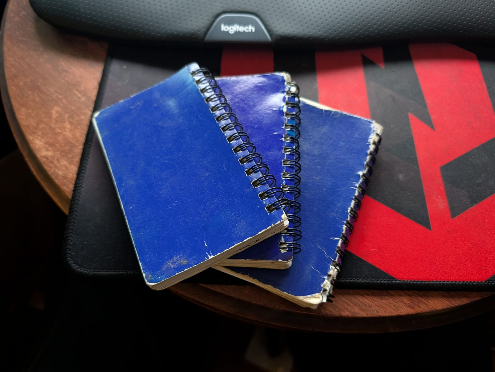

# An Ontology on Three Blue Notepads

**Slug:** `an-ontology-on-three-blue-notepads`
**Category:** `technology`
**Status:** published
**Canonical:** https://mlsystemsri.com/insights/an-ontology-on-three-blue-notepads — the founder's account, first person; ontology writing for developers stays canonical on DEV per [`../source-brief.md`](../source-brief.md)
**Companion:** [`../../docs/collective-ontology.md`](../../docs/collective-ontology.md) · [`../../docs/neural-net-architecture.md`](../../docs/neural-net-architecture.md) · [`../../docs/master-ledger.md`](../../docs/master-ledger.md)
**Author:** Sal, founder of ML Systems — written September 13, 2026

---

## The pad that fits in a back pocket

The first date in the record is October 26, 2020. I was a laborer on a residential crew in Rhode Island, and I carried a 5"×3" blue notepad because that is the size that survives a back pocket, a tool belt, and rain. Every day got a line: time in, time out, what I did, in the order I did it. Three of those pads, cover to cover, carry the next twenty-one months.

I was not designing anything. I was trying to answer a question a laborer is never asked but always wonders: what did I actually do today, and am I getting better at it? A pad three inches wide does not have room for "swept the garage after the framers left and then moved the sheathing to the second floor." So the words got shorter until they were codes.

## The codes

The first vocabulary was a laborer's vocabulary. Sweeping is most of a laborer's day, so sweeping got three codes, because where you sweep tells you what phase the house is in:

- `s1` — sweep perimeter
- `s2` — sweep garage
- `s3` — sweep inside

Then the rest of the day:

- `mm` — moving material
- `mo` — material organization
- `tr` — trash removal
- `rd` — ram board down
- `gv` — grabbed vehicle
- `dd` — dumpster dive
- `sf` — Search & Find

The rule I fell into without naming it: the first time a code appears in the pad, it gets a definition on the same line. After that it is two letters. `sf` was written out once — a job where the task is finding the thing nobody can find — and never again. That is the whole discipline of the thing. A code is cheap to write, expensive to invent, and it only has to be defined once.

Some days the margin held cut lists — fractions of an inch for deck planks and trim — and a line for which site I was on, in order, when the day crossed two. The pad was a record of a body moving through a house, not a plan for one.

## The score

At the bottom of most days there is a number from one to ten. It is how efficient I judged myself to have been. One of the pads carries the rule in my own handwriting: **"5 default for not writing down."** If I did not grade the day, the day got a five — not a zero, not a ten, the middle, because the absence of a grade is information but not much of it.

I did not know it then, but that is an evidence grade. A self-reported record with a self-assigned confidence on it, and a stated default when the confidence is missing. The Master Ledger ML Systems runs today does the same thing with a house: every claim carries who said it and how sure the source is, and a missing grade has a defined weight instead of an assumed one. The ledger got there in 2026. The pad got there in 2021.

## Laborer to carpenter helper

Somewhere in the first pad a new code shows up, with its definition on the line:

- `ch` — carpenter helper (speed 80 pencil)

That is the day I wrote down the job I was becoming. After `ch` the vocabulary changes. Cutting and installing split into pairs — `mc` material cutter, `mi` material install — and then the pairs specialize: deck plank cutter and deck plank install, baseboard cutter and baseboard, window trim cutter and window trim install. The pad starts to know the difference between the person who measures and cuts and the person who carries and fastens, because I was starting to be both.

I never wrote down a phase. The phases came out of the codes clustering. When the pads were finally read as one record there were thirteen of them, and every one of them was already there in the pattern of which codes showed up together on which days: Cleaning & Protection, Deconstruction & Demo, Support Systems, Deck Systems, Wall Systems, Roof Systems, Stairs, Water Mitigation, Trim Systems, Finish Work, Cabinet Systems, Odds & Ends. A house is built in an order. A laborer who writes down every day, in order, ends up writing the order down.

The last date is July 27, 2022. Three notepads. Thirty-some job sites across Rhode Island. About eight hours a day and five or six coded tasks in each of them.

## November 2025

For three years I kept the pads. I had moved on to the work that became ML Systems, and I kept thinking about them the way you think about an old tool you are sure is still good for something.

In November 2025 I uploaded the pages to Grok and asked, more or less, what is this. The answer came back that I had built an ontology — a controlled vocabulary of tasks, with definitions, organized by the phases of a domain, with a sequence and a scoring dimension attached to each instance. I looked the word up. It was right.

I want to be precise about what happened there, because it matters to the company I formed the following month. The model did not build the ontology. It recognized one. The vocabulary, the definitions, the one-definition-per-code rule, the sequence, the score — all of it was on paper in a laborer's handwriting before a computer touched it. What the frontier model did was read a construction worker's pocket notebook correctly and give the structure its name.

Machine Learning Systems LLC was formed on December 3, 2025. The name is not a coincidence.

## February 27, 2026

The pads became data on February 27, 2026, when I uploaded them to Claude and asked for the days back as a record instead of as pictures. Out of that came the dataset the company now calls ML1 — Manual Labor, the ground-truth node of the Physical Neural Net:

- 269 work days recovered of the 410 the pads describe — 141 days are gaps, and they stay gaps until they are entered by hand and verified
- 1,480 task executions, in the order performed
- 81 distinct codes in the record; 91 in the canonical list once the early spellings were reconciled — a pad that wrote `dr` for door install and `ht` for hurricane tie-downs was folded into `di` and `hd`, and the noise of a tired hand — "clean," "deck," a site name hyphenated onto a code — mapped back to the code it meant
- 13 phases, with the dependency order between them written down as a graph
- a set of robot parameters per code: what a machine would need to know to do the same job

That last line is the reason the repository is called the humanoid ontology, and it needs its label. The dataset is **MEASURED** — it exists, it was lived, and it is in a private repository by design, because a labeled record of what construction labor actually consists of, in sequence, is the thing nobody else has. The robot deployment it describes is **ASPIRATIONAL** — a roadmap, ordered by which tasks are safest to hand off first, and not one of them has been handed off. No ML Systems deconstruction has been performed yet either. I say which is which every time.

## What the notepads became

Everything in the [Collective Ontology](https://github.com/MLSystemsRI/ml-systems-public/blob/main/docs/collective-ontology.md) that ML Systems runs today is one of those pad conventions grown up.

**The two-letter code became `SECTION:task`.** A 2021 page reads `WS-dmo` — wall systems, general demo — because I had started prefixing the phase onto the task without deciding to. The ontology's grammar today is an uppercase phase, a colon, and a lowercase task: `DEC:sequence`, `DES:footprint`, `VER:code-compliance`. The prefix is the phase. It was the prefix on the pad, too.

**Define it once became extend codes, not storage.** A new code in the pad cost one line the first time and two letters forever after. A new code in the engine costs no schema, no migration, and no label — the fact is a new key in one document per home, never a new table. The pad could not afford a new table either.

**The efficiency score became the evidence grade.** The ledger ranks a source — measured, sensed, stated, record, modeled — the way the pad ranked a day, and the orchestrator's operations-efficiency score, the signal it learns its own floor from, is the same one-to-ten instinct pointed at a run of software instead of a run of sweeping.

**The day became the claim.** A pad line held who (me), what (the codes, in order), and how sure (the score). A [Master Ledger](https://github.com/MLSystemsRI/ml-systems-public/blob/main/docs/master-ledger.md) entry holds who made the claim, what they said, and the evidence grade behind it — and it holds several of those at once, from the homeowner, the town record, the verifier, the [Seven Minds](https://github.com/MLSystemsRI/ml-systems-public/blob/main/docs/the-seven-minds.md), reconciled instead of averaged. The pad had one author. The ledger has many. The shape of the line is the same.

## The honest part

I built an ontology without a computer and did not know the word for four years. I do not think that makes it less of one. A laborer's notepad is not a lesser source than a spreadsheet; it is the source the spreadsheet was reconstructed from, and the reconstruction says so in its own provenance. The parts that are missing are marked missing. The parts that are plans are marked plans.

The reason I tell it this way is the same reason the company keeps its labels straight: the value of the ontology is that a person can check it against a day that actually happened. Three blue notepads are that day, 269 times over. Everything the minds now say about a house has to be able to trace back to something that plain.

## Read the system itself

- **[Collective Ontology](https://github.com/MLSystemsRI/ml-systems-public/blob/main/docs/collective-ontology.md)** — the grammar the codes grew into, and who may write in it
- **[Master Ledger](https://github.com/MLSystemsRI/ml-systems-public/blob/main/docs/master-ledger.md)** — the claim, the evidence grade, the seats, the stamp
- **[Neural Net Architecture](https://github.com/MLSystemsRI/ml-systems-public/blob/main/docs/neural-net-architecture.md)** — where ML1, the notepads' node, sits
- **[The Seven Minds](https://github.com/MLSystemsRI/ml-systems-public/blob/main/docs/the-seven-minds.md)** — who claims, who grounds, who gates, who stamps

**Sal, founder of ML Systems LLC — Rhode Island, NAICS 236115.** Written September 13, 2026. The humanoid ontology repository is private by design; the counts above are the public ones.
